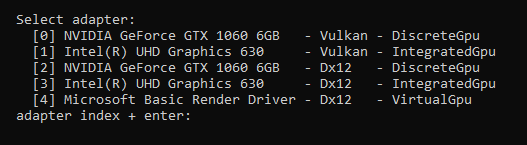
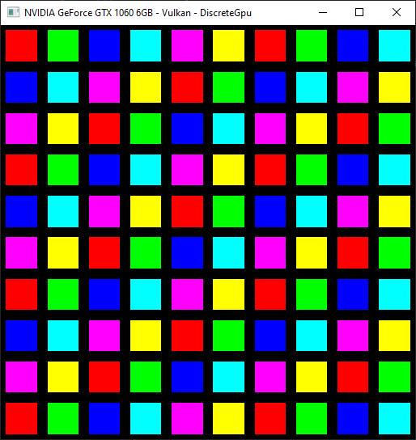
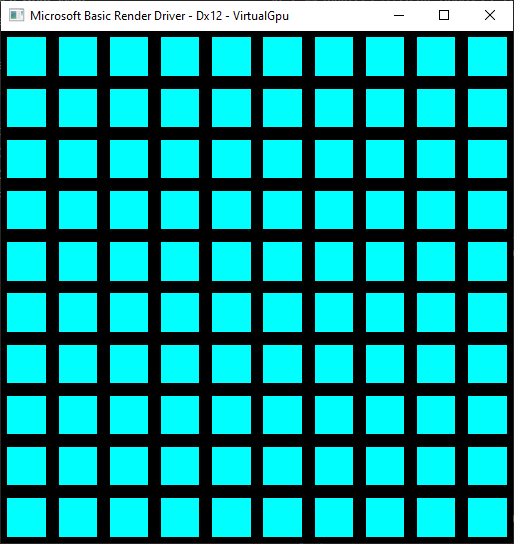

# wgpu_warp_issue

This small sample app reproduces a suspected bug in the `Microsoft Basic Render Driver` aka [WARP](https://en.wikipedia.org/wiki/Windows_Advanced_Rasterization_Platform) backend of [wgpu-rs](https://wgpu.rs/) (or perhaps in [WARP](https://en.wikipedia.org/wiki/Windows_Advanced_Rasterization_Platform) itself?).

## build and run

The sample should run on any platform, but to reproduce the issue, you should be on `MS Windows`. You need
* [git](https://git-scm.com/downloads) to clone this repo
* [Rust and Cargo](https://www.rust-lang.org/learn/get-started) to build and run the code

To build and run the sample:
1. Open a terminal and point it to some directory where the project can be deployed
2. Clone this repository
   ```
   > git clone https://github.com/kwillemsen/wgpu_warp_issue.git
   ```
3. Step into the newly cloned repo's root
   ```
   > cd wgpu_warp_issue
   ```
4. Build and [run the code](https://doc.rust-lang.org/cargo/commands/cargo-run.html)
   ```
   > cargo run
   ```

When the application starts, you need to select a backend from the command line. On my current machine, the menu looks like this



The sample will then use the selected backend to draw a bunch of quads, each with a different color. If you didn't select `Microsoft Basic Render Driver` you should see the correct result: 



However, if you are running on `MS Windows` and select `Microsoft Basic Render Driver` (option `4` on my machine, but YMMV) the result will be incorrect: every rectangle will have the same color



## code

The sample represents each quad as its own entity:
```
    struct Entity {
        vertex_buffer: Buffer,
        index_buffer: Buffer,
        constant_buffer: Buffer,
        bind_group: BindGroup,
        num_indices: u32,
        constant_data: [u8; 16],
    }
```
Each of them has its own vertex buffer, index buffer, constant buffer and bind group. The [render loop](src/main.rs#L193-L248) has two phases:
1. Update each entity's constant buffer through `Queue::write_buffer()`.
2. Create a `CommandEncoder` and `RenderPass` and draw all entities.

        //
        // Phase 1 : update constant buffers.
        //
        for e in &entities {
            queue.write_buffer(&e.constant_buffer, 0, &e.constant_data); // <-- Problem here?
        }

        //
        // Phase 2 : draw all entities.
        //
        let mut encoder = device.create_command_encoder(/*...*/);
        {
            let mut render_pass = encoder.begin_render_pass(/*...*/);
            render_pass.set_pipeline(&render_pipeline);
            for e in &entities {
                render_pass.set_vertex_buffer(0, e.vertex_buffer.slice(..));
                render_pass.set_index_buffer(e.index_buffer.slice(..), wgpu::IndexFormat::Uint32);
                render_pass.set_bind_group(0, &e.bind_group, &[]);
                render_pass.draw_indexed(0..e.num_indices, 0, 0..1);
            }
        }

        queue.submit(iter::once(encoder.finish()));

I assume the problem is in the updating of constant buffers. It seems as if all of them are filled with the data of the last entity in the loop.

## Explicit staging buffers

In an attempt to work around the issue, I tried using explicit staging buffers to upload constant data. This functionality is available when [runing the app](https://doc.rust-lang.org/cargo/commands/cargo-run.html) with the `-s` flag
```
cargo run -- -s
```
It did not fix the issue.

## API trace

The sample can generate an API trace through [wgpu-rs](https://wgpu.rs/). To enable this feature, [run the sample](https://doc.rust-lang.org/cargo/commands/cargo-run.html) with the `-t` flag
```
> cargo run -- -t <existing-directory-path>
```
This will store the trace files in `<existing-directory-path>` (which - as the name suggests - must be an existing directory). A [pre-created trace](api_trace/) is available in this repo.